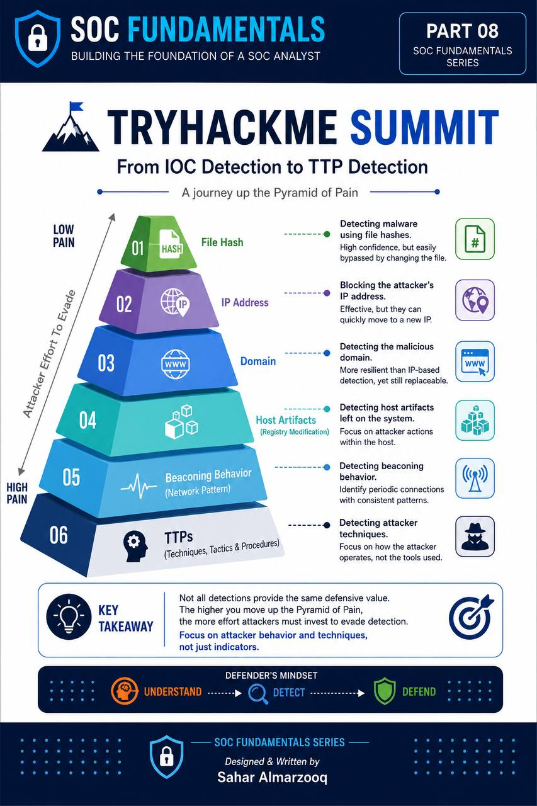

# 🛡️ Detection Engineering – Pyramid of Pain

## Overview

This project demonstrates the evolution of threat detection strategies based on the Pyramid of Pain model. Rather than relying solely on traditional Indicators of Compromise (IOCs), it focuses on building layered detection capabilities that progress toward identifying attacker behaviors and Techniques, Tactics, and Procedures (TTPs).

Throughout this project, multiple detection approaches are explored, beginning with simple file-based indicators and advancing toward behavioral analytics and Detection Engineering concepts. The goal is to understand how different detection methods increase the operational cost for attackers while improving defensive visibility.

---

## Objectives

- Understand the Pyramid of Pain model.
- Learn the strengths and limitations of different detection methods.
- Build layered detection strategies.
- Develop Sigma detection rules.
- Detect malicious host artifacts.
- Identify beaconing behavior.
- Understand TTP-based detection using MITRE ATT&CK.

---

## Detection Journey

| Stage | Detection Focus | Detection Method |
|--------|-----------------|------------------|
| 1 | File Hash | Hash Blocklist |
| 2 | IP Address | Firewall Rule |
| 3 | Domain Name | DNS Filtering |
| 4 | Host Artifacts | Registry-based Sigma Rule |
| 5 | Network Behavior | Beaconing Detection |
| 6 | TTPs | Behavioral Detection & MITRE ATT&CK |

---

## Detection Strategy Evolution

The project demonstrates how detection strategies evolve through progressively more resilient techniques.

| Stage | Focus | Detection Method |
|-------|-------|------------------|
| 1 | File Identity | SHA256 Hash Detection |
| 2 | Network Indicator | IP Address Blocking |
| 3 | Infrastructure | Domain Filtering |
| 4 | Host Artifact | Registry Monitoring |
| 5 | Behavior | Beaconing Detection |
| 6 | Tactics & Techniques | TTP-Based Detection |

Each stage increases the difficulty for attackers to evade detection while reducing the defender's dependence on easily replaceable Indicators of Compromise (IOCs).

---

## Skills Demonstrated

- Detection Engineering
- Detection Engineering Lifecycle
- Security Operations Center (SOC)
- Threat Detection
- IOC Analysis
- Behavioral Detection
- Sigma Rule Development
- MITRE ATT&CK Mapping
- Windows Security Monitoring
- Network Traffic Analysis
- Threat Hunting Fundamentals

---

## Tools & Technologies

- TryHackMe
- Sigma Rules
- Sysmon
- Windows Event Logs
- Windows Registry
- Firewall Rules
- DNS Filtering
- MITRE ATT&CK Framework

---

## Key Takeaways

- File hashes provide high-confidence detection but are easily changed.
- IP and domain blocking can delay attackers but are simple to bypass.
- Host artifacts offer stronger detection by monitoring system modifications.
- Behavioral detections such as beaconing identify malicious communication patterns.
- Detecting attacker techniques and procedures provides the most resilient defensive strategy because changing TTPs requires significantly more effort from adversaries.

---

## Repository Structure

```text
Detection-Engineering-Pyramid-of-Pain/
│
├── README.md
├── LICENSE
├── Resources.md
│
├── Images/
│   └── tryhackme-summit-infographic.jpg
│
├── Report/
│   └── Detection-Engineering-Pyramid-of-Pain.md
│
└── Sigma-Rules/
    ├── detect-defender-tampering.yml
    ├── sigma-rule-02.yml
    └── sigma-rule-03.yml
```

---

## Project Visuals

### TryHackMe Summit – Detection Journey

The infographic below summarizes the progression of detection strategies throughout the Pyramid of Pain, illustrating how detection evolves from simple Indicators of Compromise (IOCs) to resilient TTP-based detection.



---

## Lab

This project is based on the **Summit** room available on TryHackMe and demonstrates practical Detection Engineering concepts through progressively stronger detection strategies aligned with the Pyramid of Pain model.

---

## References

The references used in this project are available in **Resources.md**.

---

## License

This project is licensed under the MIT License.
